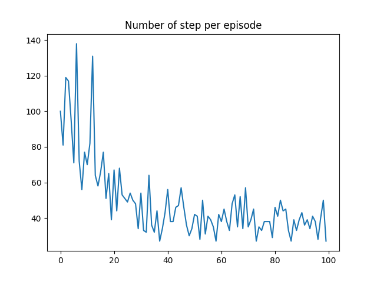

Here is an Q-function actor-critic algorithm with a buffer made to reach a program that produces a desired signature. The desired signature is fixed and corresponds to a fixed random prorgram.
Thus, this is not a curiosity driven exploration loop, because these is a single objective.
The desired interference is a 3-dimensional point, with component of very different scales. Therefore, we introduce a weighted distance in the behavior space.
During the training, each episode starts with a random program, with a random number of lines from 1 to 5. During the training, we want the episodes to be shorter and shorter.

The reward is chosen as the negativ weighted distance between the state (program) and the objective. 

Below, we represent the number of step per episodes during the training phase

In Class.py:

* Env.__call__(action:dict, program:str) implements the transition in our environment, i.e the code modification for a chosen action.
* OnlineActorCritic( 
            qfunction,
            optimizerQ,
            policy,
            optimizerPi,
            goalinterference,
            epsilon =0.1,
            gamma = .9,
            K = 5,
            maxsize = 10,
            batch_size  = 10)
* OnlineActorCritic.train(start,nEpisodes) performs the training
